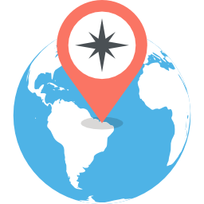
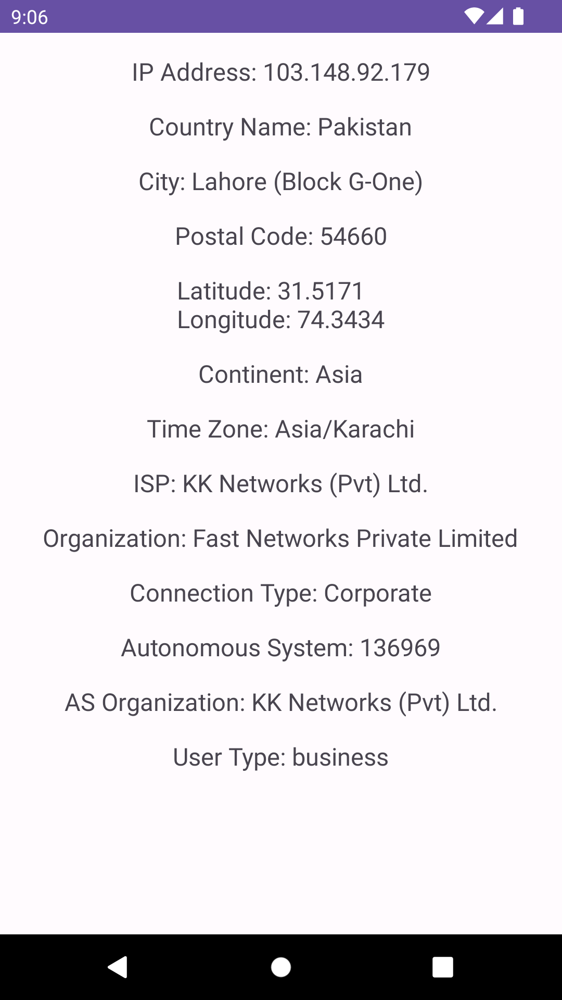

## IP Geography Kit



IP Geography Kit is a powerful Android library designed to simplify the process of obtaining comprehensive geo-location information for a given IP address. This library equips developers with a set of intuitive tools and model classes to seamlessly integrate geo-location data into Android applications. Whether you need to fetch user location details, enrich user profiles, or customize user experiences based on their geographic location, IP Geography Kit has you covered.

### Key Features

- **Effortless Integration**: Quickly integrate geo-location functionality into your Android app using the provided code and model classes.

- **Detailed Geo-Location Data**: Retrieve precise information, including city, country, continent, latitude and longitude, postal codes, subdivisions, and more.

- **Multi-Language Support**: Access localized location names with ease using our comprehensive `Names` model class. Retrieve names in various languages, such as German (`getDe()`), English (`getEn()`), Spanish (`getEs()`), French (`getFr()`), Japanese (`getJa()`), Korean (`getKo()`), Portuguese (`getPtBR()`), Russian (`getRu()`), and Chinese (`getZhCN()`).

- **Autonomous System Information**: Get insights into the Autonomous System (AS) associated with an IP address, including AS number (`getAutonomousSystemNumber()`) and AS organization (`getAutonomousSystemOrganization()`).

- **Connection Details**: Understand the user's connection type (`getConnectionType()`) and Internet Service Provider (`getIsp()`) for tailored user experiences.

- **Organization Data**: Retrieve the organization (`getOrganization()`) associated with the IP address and user type (`getUserType()`) information.

- **Error Handling**: Robust error handling ensures that your app gracefully handles situations where geo-location data cannot be retrieved.

- **Sleek UI Integration**: Easily integrate geo-location data into your app's user interface for a seamless user experience.

---

## Installation

To integrate the IP Geography Kit library into your Android project, follow these simple steps:

### Step 1: Add the JitPack Repository

Add the JitPack repository to your project's root `build.gradle` file under the `allprojects` section:

```gradle
allprojects {
    repositories {
        ...
        maven { url 'https://jitpack.io' }
    }
}
```

### Step 2: Add the Dependency

Add the library dependency to your app-level `build.gradle` file:

```gradle
dependencies {
    implementation 'com.github.zenara1n:ip-geography-kit:1.0.1’
}
```

That's it! You've successfully integrated IP Geography Kit into your Android project.

### How to Use

Integrating IP Geography Kit into your Android application is straightforward. Simply follow the provided code samples and model classes to access rich geo-location data effortlessly.

Here's a quick peek at how to access localized country names in English:

```java
String countryName = geoLocation.getCountry().getNames().getEn();
```

Make your Android app location-aware and deliver personalized experiences with IP Geography Kit.

For more details on API usage, refer to the [API Usage](#api-usage) section below.

### Example Usage

```java
// Initialize IP-Geography-Kit with your token
GeoLocationHelper.initializeToken("ADD_YOUR_TOKEN_HERE");

// Get GeoLocation object from IpGeographyKit
GeoLocationHelper.getGeoLocation(this, new GeoLocationHelper.GeoLocationListener() {
    @Override
    public void onGeoLocationReceived(String ip, GeoLocation geoLocation) {
        // Check for null values and set UI elements
        if (ip != null) {
            ipAddrTextView.setText("IP Address: " + ip);
        } else {
            ipAddrTextView.setText("Error fetching IP address");
        }

        if (geoLocation != null) {
            // Access localized country name in English
            String countryName = geoLocation.getCountry().getNames().getEn();
            countryNameTextView.setText("Country Name: " + countryName);

            // ... other geo-location data retrieval and UI updates
        } else {
            countryNameTextView.setText("Error fetching country name");
            // Handle other error cases
        }

        // Update UI elements
        rl.setVisibility(RelativeLayout.VISIBLE);
        pcv.setVisibility(LinearProgressIndicator.GONE);
    }

    @Override
    public void onGeoLocationError(String error) {
        Log.e("IP-Geography-Kit", error);
        MainActivity.this.error.setText("IP-Geography-Kit: " + error);
        pcv.setVisibility(LinearProgressIndicator.GONE);
    }
});
```

Explore the full capabilities of IP Geography Kit and create location-aware Android apps that provide personalized experiences for your users.

---

## GeoLocation Class

The `GeoLocation` class is the heart of IP Geography Kit, encapsulating comprehensive geo-location data for a given IP address. This class provides access to various location details, making it easy to create location-aware Android applications.

### Properties

- **`getCity()`**: Access city-specific information, including a unique `geoname_id` and localized city names (e.g., `getNames().getEn()` for English).

- **`getContinent()`**: Retrieve the continent information, which includes a `code`, `geoname_id`, and localized continent names (`getNames().getEn()`

for English).

- **`getCountry()`**: Obtain data about the country, such as `geoname_id`, `iso_code`, and localized country names (`getNames().getEn()` for English).

- **`getLocation()`**: Access geographical coordinates, including `latitude`, `longitude`, `time_zone`, and `weather_code`.

- **`getPostal()`**: Retrieve postal code information (`getCode()`).

- **`getSubdivisions()`**: Access information about subdivisions or regions within the country, including `geoname_id`, `iso_code`, and localized subdivision names (`getNames().getEn()` for English).

- **`getTraits()`**: Retrieve traits associated with the geo-location, such as `autonomous_system_number`, `autonomous_system_organization`, `connection_type`, `isp`, `organization`, and `user_type`.

### Example Usage

Here's a quick example of how to access the localized city name in English:

```java
String cityName = geoLocation.getCity().getNames().getEn();
```

Explore the various properties of the `GeoLocation` class to create dynamic and location-aware Android applications with ease.

---

## Screenshots



### API Usage

This project uses the following APIs to retrieve IP address information:

- [ipify.org](https://www.ipify.org/): For obtaining the public IP address of the device.
- [findip.net](https://findip.net/): For accessing geo-location information based on the IP address. To use this API, you will need to obtain a token from [findip.net](https://findip.net/).

Please note that these APIs are  **`FREE`** to use and offer  **`unlimited resources`**, making them suitable for various applications. For more information about these APIs and to explore their capabilities, visit their respective websites.

To get your API token, visit [findip.net](https://findip.net/) and sign up for an account. Once you have your token, you can initialize the IP-Geography-Kit library as shown in the example usage section.

Please note that the

use of the findip.net API requires a valid token for authentication.

### Thanks & Support

Your support and contributions are greatly appreciated!

If you encounter any issues, have questions, or want to contribute to the IP Geography Kit project, please feel free to reach out. Here's how you can get in touch:

- **GitHub Repository**: [IP Geography Kit)](https://github.com/zenara1n/ip-geography-kit)
- **Email**: zxzayn@gmail.com
- **linkedin**: [linkedin](https://www.linkedin.com/in/zaynal/)

Your feedback helps us improve the library and provide better support to our users.

---

## Reporting Issues

If you encounter any bugs, issues, or have feature requests, please open an issue on our GitHub repository. Your feedback and bug reports are essential for enhancing IP Geography Kit.

[Link to Issue Tracker](https://github.com/zenara1n/ip-geography-kit/issues)

Thank you for using IP Geography Kit, and I look forward to helping you create amazing location-aware Android applications!
